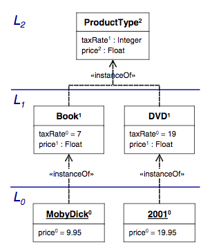

Multi-level programming with NX/Tcl
-----------------------------------

stefan.sobernig_at_wu.ac.at

This is a proof-of-concept implementation of a notion of +deep
characterization+ (+potency+) in NX/Tcl as found in the following
paper:

Thomas Kühne and Daniel Schreiber (2007). Can programming be
liberated from the two-level style: Multi-level programming with
DeepJava. In: Proc. OOPLSA'07. ACM, DOI:
http://dx.doi.org/10.1145/1297027.1297044

For a background on NX/Tcl, pls. see https://next-scripting.org/.

On the surface similar, but naturally quite different beneath,
deep characterization in NX/Tcl is implemented using:

. instantiation chains between metaclasses (everything-is-a-class,
  EIAC). In NX/Tcl, classes are objects themselves, and can be
  made behaving like +clabjects+ (i.e., metaclasses creating
  further metaclasses).
. property and method combination along these instantiation chains
  with explicit depth

=== Usage

This proof-of-concept is implemented as Tcl module, to you can
require it into your Tcl scripts:

`package require deep`

If you want to run the embedded tests, run:

`tclsh deep-0.1.tm`

For demonstration purposes, consider the example taken from the
OOPSLA'07 paper, Fig. 6: "Deep Instantiation".

[[fig6]]

The top level +L2+ can be defined as follows, using the root
metaclass +Clabject+:

[source,tcl]
--------------------------------------------------
 Clabject create ProductType {
  :property -potency 0 -accessor public count; # potency 0 -> object property
  :property -potency 1 -accessor public taxRate:integer; # potency 1 -> property
  
  :property -potency 2 -accessor public price:double; # potency 1+ 
  :public -potency 2 method checkPrice {} {
    return [expr {${:price} > 1000}]
  }
  
}
--------------------------------------------------

Any +Clabject+ instance (e.g., +ProductType+):

* is a +Clabject+ on its own, and capable of producing further +Clabject+ instance downstream.
* allows for annotating +property+ and +method+ with a +-potency+ (positive number: 0, 1, 2, ...)
* a `-potency` of `0` maps to the per-object scope in NX/Tcl, a `-potency` of `1` to the instance level.
* any `-potency` greater or equal than `2` is a deep feature. For
  example, the property `price` and the method `checkPrice` defined at `L2` so
  become available at level `L0`.

The intermediate level L1 is populated by instantiating the L2 clabject +ProductType+:

[source,tcl]
--------------------------------------------------
ProductType create Book
ProductType create Dvd 
--------------------------------------------------

Everything is a clabject (L2, L1):

[source,tcl]
--------------------------------------------------
% ProductType info has type Clabject
1
% Book info has type Clabject
1
% Dvd info has type Clabject
1
--------------------------------------------------

The level L0 is then populated by instances from the L1 concepts:

[source,tcl]
--------------------------------------------------
 Dvd create 2001
Book create MobyDick
--------------------------------------------------

Again, the resulting L0 concepts are again represented as clabjects:

[source,tcl]
--------------------------------------------------
% 2001 info has type Clabject
1
% MobyDick info has type Clabject
1
--------------------------------------------------

We can introspect on the instantiation chain of clabjects:

[source,tcl]
--------------------------------------------------
% MobyDick info clabjects
::deep::test::Book ::deep::test::ProductType ::deep::Clabject
 
--------------------------------------------------

The two deep features defined at level L2 with potency 2 now are available at L0:

[source,tcl]
--------------------------------------------------
 
% 2001 price set 9.95
9.95
% 2001 checkPrice
0
% MobyDick price set 9.95
9.95
% MobyDick checkPrice
0
 
--------------------------------------------------

and only at level L0, not L1:

[source,tcl]
--------------------------------------------------
 
% Book info lookup methods price
% Book taxRate set 10
10
 
--------------------------------------------------

There are some goodies in NX/Tcl. We can add new deep features dynamically:

[source,tcl]
--------------------------------------------------
 
ProductType public -potency 2 method foo args {
  return [string toupper [current method]]
}
 
--------------------------------------------------

They become available to the deeply characterized level right away:

[source,tcl]
--------------------------------------------------
 
% 2001 info lookup methods foo
foo
% 2001 foo
FOO
 
--------------------------------------------------

In addition, we can add an arbitrary number of further instantiation levels (+L-1+):

[source,tcl]
--------------------------------------------------
 Book property -potency 2 -accessor public printVolume:integer; # L1!
  
MobyDick create 1stEdition -printVolume 1000; # L-1!
MobyDick create 2ndEdition -printVolume 2000; # L-1!
 
--------------------------------------------------

Again, all clabjects:

[source,tcl]
--------------------------------------------------
% 1stEdition info has type Clabject
1
% 2ndEdition info has type Clabject
1
% 2ndEdition printVolume get
2000
--------------------------------------------------

=== Implementation

.TODO list
- Extend introspection `info clabjects` to walk both directions
- Test preservation of local-precedence orders in `setAncestors`
- Add more examples

[source,tcl]
--------------------------------------------------
 
nx::Class create Clabject -superclasses Class {
  
  :property -accessor public [list superclasses:class [self]] {
    :public object method value=set {class property value} {
      set value [uplevel 2 [list lmap x $value {$x}]]; # Irgh! This should not be necessary.
      $class setAncestors $value ${:default}
    }
    :public object method value=get {class property} {
      return [::nsf::relation::get $class superclass]
    }
  }
   :private method computePotencyClasses {} {
    set clobjs [:info clabjects]
    set lvlcls [list]
    for {set i 0} {$i < [llength $clobjs]} {incr i} {
      set clobj [lindex $clobjs $i]
      set lvl [expr {$i+2}]
      if {[::nsf::object::exists ${clobj}::$lvl]} {
        lappend lvlcls ${clobj}::$lvl
      }
    }
    return $lvlcls
  }
  
  :public method setAncestors {local default} {
    set current [nsf::relation::get [self] superclass]
    set lvlcls [: -local computePotencyClasses]
    if {$current eq "::nx::Object"} {
      # the default scenario, value -> Clabject
      set scl [list {*}$lvlcls {*}$local]
    } else {
      set scl [list {*}$local {*}$lvlcls $default]
    }
    ::nsf::relation::set [self] superclass [dict keys [dict create {*}"[join $scl " _ "] _"]]
  }
  
  :public method "info clabjects" {} {
    set cl [:info class]
    if {$cl eq [current class]} {
      return $cl
    } else {
      return [list $cl {*}[$cl info clabjects]]
    }
  }
  :private method makeDeepFeature {potency args} {
    set potClassName "[self]::${potency}"
    if {![nsf::object::exists $potClassName]} {
      nx::Class create $potClassName
    }
    $potClassName {*}$args
    :updateDescendants
  }
   :public method updateDescendants {} {
    foreach i [:info instances] {
      $i setAncestors [$i cget -superclasses] [current class]
      $i updateDescendants
    }
  }
  
  :public method property {{-potency 1} args} {
    switch -- $potency {
      0 {:object property {*}$args}
      1 {next [list {*}$args]}
      default {
        : -local makeDeepFeature $potency [current method] {*}$args
      }
    }
  }
   :public method public {{-potency 1} args} {
    switch -- $potency {
      0 {:public object {*}$args}
      1 {next [list {*}$args]}
      default {
        : -local makeDeepFeature $potency [current method] {*}$args
      }
    }
  }
   :public method protected {{-potency 1} args} {
    switch -- $potency {
      0 {:protected object {*}$args}
      1 {next [list {*}$args]}
      default {
        : -local makeDeepFeature $potency [current method] {*}$args
      }
    }
  }
}
 namespace export Clabject
--------------------------------------------------

